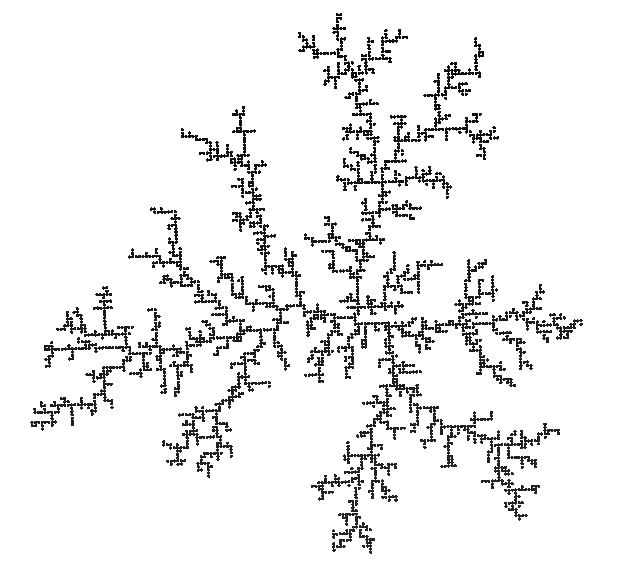

# dla
Grow particle clusters via Diffusion Limited Aggregation

This simulator models the growth of DLA clusters, in 2 or 3 dimensions, on or
off an underlying lattice.  It uses both MPI and OpenMP to grow an ensemble 
of independent clusters in an embarassingly parallel manner.  

Outputs include cluster particle positions in standard XYZ format, density
correlations, cluster radii, radius of gryation, and capture fraction. 

This code is distributed under the GNU General Public License (GPL), version 3.
The NearTree library (see lib/NearTree-3.1.1/) is distributed under the 
GNU Lesser General Public License (LGPL), version 2.1.



# Build
```
./configure [--with-boost] [--with-mpi] [--with-openmp]
make
```

# DLA input file
```
# comment 
total_clusters      = 1           # all processes, all threads
process_threads     = 1

cluster_particles   = 3e3
medium              = lattice_2D  # lattice_2D, lattice_3D, fluid_2D, fluid_3D
start_distance      = 20.0
step_size           = 1.0         # lattice parameter for lattice_?D media
particle_radius     = 0.5
capture_distance    = 1.1
stickiness          = 1.0

growth_step         = 30          # 0: disable radius growth output
xyz_step            = 3e3         # 0: disable XYZ output
status_step         = 0           # 0: disable status output (rank 0, cluster 0)
density_bin         = 1           # 0: disable density correlation output

rng_seed            = 12345       # 0: use current time

log_file            = dla.log     # default: stdout
```

# Run
Prepare an input file, as above.  Run `DLA` from the command line.  If you 
built DLA with MPI, use `mpiexec -np n` where n is the number of processors.


